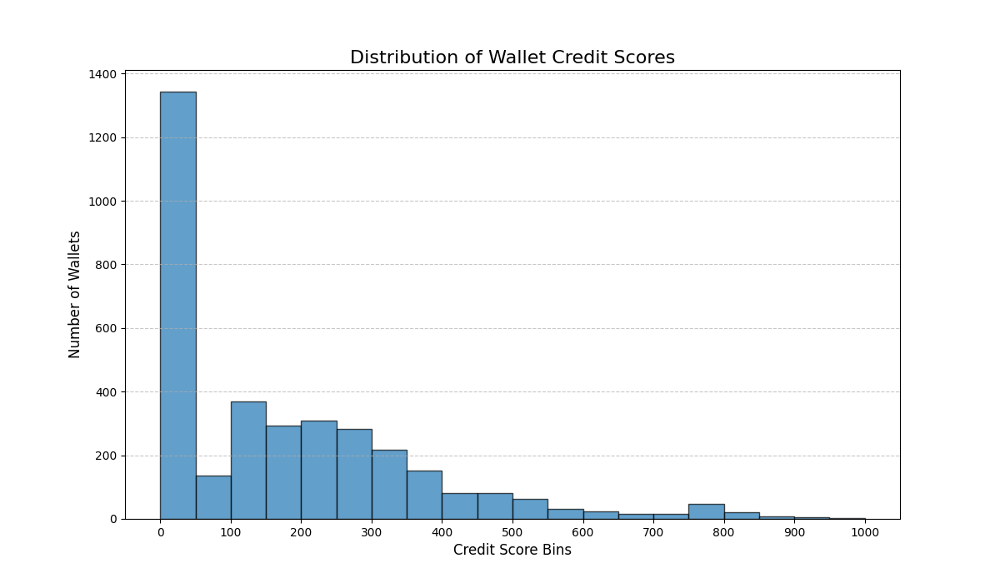

# 📈 Wallet Score Analysis

This analysis delves into the results from the Isolation Forest-based credit scoring model, examining the distribution of scores and the on-chain behaviors that characterize wallets across the spectrum.

## Score Distribution Analysis

The distribution of scores provides a high-level overview of the credit health of the user base.

The distribution is heavily skewed towards the higher end, suggesting that most wallets in this dataset exhibit behaviors the model considers "normal" and non-risky. The smaller clusters at the lower end represent wallets flagged by the model as anomalous.

## Behavioral Profile by Score Range

### Lower Range (0-400): The Anomalies 🚨

Wallets in this bracket are flagged by the Isolation Forest model as being significantly different from the majority. Their behavior often includes a combination of:
* **High-Risk Financials**: Extremely high **LTV ratios**, often coupled with a **low repayment ratio**. These are classic signs of over-leveraging.
* ** liquidationcall Events**: A history of liquidations is one of the strongest indicators of an anomaly and severely impacts the score.
* **Erratic Temporal Patterns**: A very short **`deposit_to_borrow_lag_hours`**, suggesting an immediate leveraging of deposited funds, which can be indicative of high-risk or bot-driven strategies.
* **Flash Loan Usage**: The `is_flash_loan_user` flag will isolate these specialized users, whose behavior is inherently different from standard deposit/borrow activities.

### Mid-Range (400-750): The Average User 👤

This is the largest cohort of users. Their behavior is consistent and predictable, making them "hard to isolate" for the model.
* **Balanced Financials**: They maintain healthy **LTV ratios** and show a consistent history of repayments.
* **No Red Flags**: These wallets have **no liquidations**.
* **Organic Activity**: Their transaction frequency and timing appear natural, without the rapid, automated patterns seen in the lower-range wallets.

### Higher Range (750-1000): The DeFi Power Users & Savers ✨

These wallets represent the ideal credit profile within the Aave ecosystem. The model identifies them as the most "normal" and stable participants.
* **Low-Risk and High-Value**: They often have a **high `total_volume_usd`** and a significant **`net_deposits_usd`**, indicating they are net liquidity providers.
* **Excellent Financial Health**: Their **LTV ratios are very low**, and their **repayment ratios are near or above 1**, showing they consistently pay back any debt they take on.
* **Long-Term Stability**: They have a long history of activity (`days_active`) and demonstrate consistent, non-erratic behavior, reflected in a low `transaction_value_std_dev`.